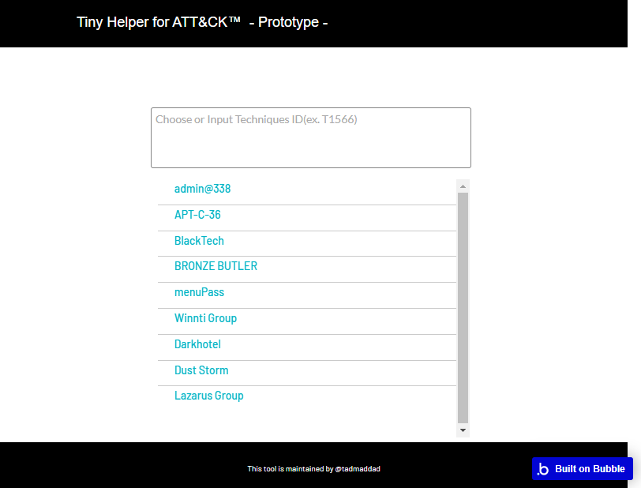
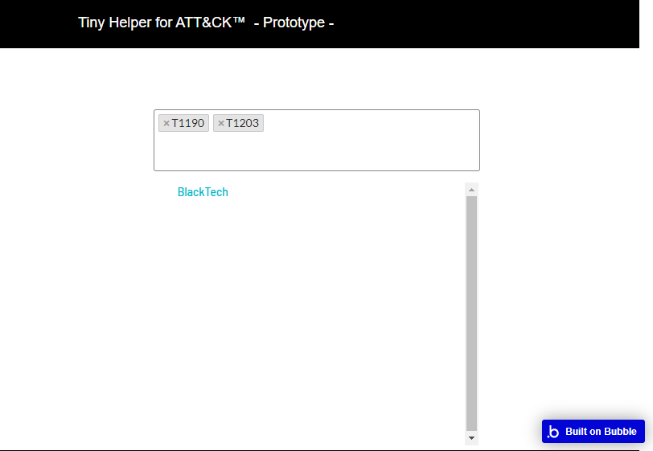

# attack-tiny-helper

This is a Tiny tool for ATT&CK.
Maybe that can help, If you want searching adversary by few Techniques ID.
I'm not good at programing.
So, I've built by no-code platforms Bubble.
By the way, this tool is still a prototype.

# ScreenShots

# Url
https://attack.bubbleapps.io/
